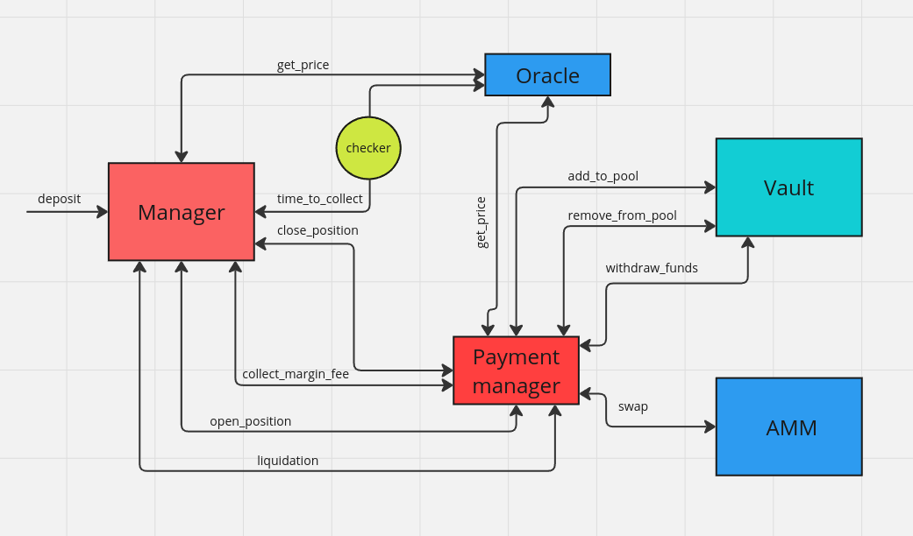

# Dazhbog: Decentralized Perpetual Futures on Polkadot

Dazhbog is a decentralized perpetual futures exchange built on Polkadot for the Polkadot Prodigy hackathon. It utilizes ink! smart contracts to facilitate peer-to-peer margin trading of perpetual contracts.


[Miro board](https://miro.com/app/board/uXjVKDOV49s=/?share_link_id=628179226125).

## Getting Started

To interact with Dazhbog, you'll need to have ink! and Cargo installed on your system. Here's a quick guide:

1. **Installation:**

In addition to Rust, installation requires a C++ compiler that supports C++17.
Modern releases of gcc and clang, as well as Visual Studio 2019+ should work.

-   Step 1: `rustup component add rust-src`.

-   Step 2: `cargo install --force --locked cargo-contract`.

-   Step 3: Install dependencies for linting.

    -   (MacOS) `brew install openssl`
    -   ```
        export TOOLCHAIN_VERSION=nightly-2024-02-08
        rustup install $TOOLCHAIN_VERSION
        rustup component add rust-src --toolchain $TOOLCHAIN_VERSION
        rustup run $TOOLCHAIN_VERSION cargo install cargo-dylint dylint-link
        ```
You can always update the `cargo-contract` binary to the latest version by running the Step 2.

3. **Clone this repository:**

   ```bash
   git clone https://github.com/rastkocbs/dazhbog.git

4. **Build the project:**

   ```bash
   cd manager
   cargo contract build --release

## User Scenarios

### Longing an Asset (Win Scenario):

- User deposits funds (e.g., USDC) as collateral into the Dazhbog contract.
- User specifies the desired leverage (e.g., 5x) and the amount of perpetual contract to long (e.g., 100 DOT).
- Dazhbog automatically calculates the required margin fee based on the - leverage and contract size.
- User approves the margin transfer from their wallet to the contract.
- The contract creates a long position for the user, representing a leveraged bet on the price of DOT increasing.
- As the price of DOT goes up, the value of the user's position increases.
- User decides to close the position at a profit.
- Dazhbog calculates the profit based on the entry and exit price, considering leverage.
- User withdraws the initial collateral deposit and the earned profit from the contract.

### Longing an Asset (Loss Scenario):

- User follows steps 1-4 as in the win scenario.
- The price of DOT goes down instead of up.
- The value of the user's long position decreases.
- As the price falls further, the contract might require additional collateral from the user to maintain the minimum margin ratio (maintenance margin). This is called a margin call.
- User can either:
    - Deposit more funds to meet the margin call.
    - Close the position at a loss.
- If the user fails to meet the margin call, the contract will automatically liquidate their position. The user will lose their initial collateral deposit and any unrealized profits.

### Shorting an Asset (Win Scenario):

- User deposits funds (e.g., USDC) as collateral into the Dazhbog contract.
- User specifies the desired leverage (e.g., 5x) and the amount of perpetual contract to short (e.g., 100 DOT).
- User approves the collateral transfer from their wallet to the contract.
- The contract creates a short position for the user, representing a leveraged bet on the price of DOT decreasing.
- As the price of DOT goes down, the value of the user's position increases.
- User decides to close the position at a profit.
- User withdraws the initial collateral deposit and the earned profit from the contract.

### Shorting an Asset (Loss Scenario):

- User follows steps 1-4 as in the win scenario.
- The price of DOT goes up instead of down.
- The value of the user's short position decreases.
- The contract might require additional collateral from the user to maintain the minimum margin ratio.
- User can either:
    - Deposit more funds to meet the margin call.
    - Close the position at a loss.
- If the user fails to meet the margin call, the contract will automatically liquidate their position. The user will lose their initial collateral deposit and any unrealized profits. 


### Usage



User deposits funds to Vault contract via Manager contract calling `open_position` function. Manager contract update storage mappings with info about position: `amount`,`leverage`,`entry_price`. Manager pings Oracle for price using `get_price` and calculate `liquidation_price`. 

Manager invoke `collect_margin_fee` on Payment Manager contract every 3h to collect calculated margin fee. 

Payment Manager calls `withdraw_funds`, `add_to_pool` or `remove_from_pool` functions on Vault contract to add assets, pay reward, close position or liquidate.

Payment Manager uses AMM's `swap` function to exchange assets.

